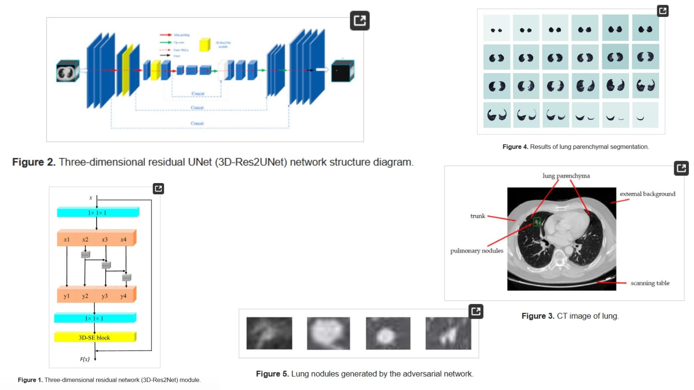

# 👤 3DRes2UNet-Replication — Hierarchical Residual Volumetric Segmentation

This repository provides a **PyTorch-based research replication** of  
**3D-Res2UNet: A 3D Residual Network with Multi-Scale Feature Fusion for Lung Nodule Segmentation**,  
reproduced as a **theory-faithful volumetric medical segmentation framework**.

The project translates the paper’s **3D-Res2Net hierarchical residual blocks, encoder–decoder topology, and channel-wise attention**
into a clean, modular, and extensible research codebase.

- Enables **high-precision lung nodule segmentation in 3D CT volumes** 🫁  
- Implements **multi-scale residual feature fusion via 3D-Res2Net blocks** 🧬  
- Integrates **SE attention for channel-wise feature recalibration** ✶  
- Designed for **clinical-grade volumetric inference** 🜁
  
**Paper reference:**  [3D-Res2UNet: A 3D Residual Network with Multi-Scale Feature Fusion for Lung Nodule Segmentation — Liu et al., 2022](https://www.mdpi.com/2073-8994/12/11/1787) 📄


---

## 🝆 Overview — 3D Residual Multi-Scale Segmentation Pipeline



The core idea:

> Lung nodules exhibit highly variable morphology, density, and edge structure — requiring hierarchical multi-scale reasoning.

Instead of relying on a single receptive field, the network performs **progressive volumetric abstraction**:

$$
V \longrightarrow \hat{Y}
$$

where the model learns a volumetric mapping

$$
f_\theta : \mathbb{R}^{D \times H \times W} \rightarrow \mathbb{R}^{D \times H \times W \times K}
$$

and produces a dense segmentation volume $\hat{Y}$ from a 3D CT scan $V$.

The architecture follows a **symmetric encoder–decoder design** enriched with **hierarchical residual feature fusion**.

---

## 🧠 Architectural Principle — 3D-Res2UNet

At the heart of the network lies the **3D-Res2Net block**, which decomposes feature channels into multiple groups and processes them hierarchically:

$$
X = [x_1, x_2, ..., x_s]
$$

Each group is processed sequentially:

$$
y_i = F_i(x_i + y_{i-1})
$$

and fused as

$$
Y = [y_1, y_2, ..., y_s]
$$

followed by residual projection and SE attention:

$$
\hat{Y} = \text{SE}(Y + X)
$$

This creates a **single residual block with multiple receptive fields**, enabling:

- Fine-grained edge modeling  
- Robust small-object detection  
- Strong shape preservation  

---

## 🔬 Mathematical Formulation

Let the input CT volume be

$$
V \in \mathbb{R}^{D \times H \times W}
$$

The network learns a voxel-wise classifier:

$$
p(y_{ijk} \mid V) = \text{Softmax}(f_\theta(V)_{ijk})
$$

Training is performed using Dice loss:

$$
\text{Dice} = \frac{2|P \cap G|}{|P| + |G|}
$$

$$
\mathcal{L}_{dice} = 1 - \text{Dice}
$$

where  
$P$ is the predicted mask and  
$G$ is the ground-truth mask.

This objective directly optimizes volumetric overlap — critical for medical segmentation.

---

## 🩻 Medical Data Preprocessing

CT volumes are represented in **Hounsfield Units (HU)**.  
The lung tissue intensity distribution is approximately centered around **-500 HU**.

Voxel values are clipped and normalized:

$$
I_{norm} = \frac{\text{clip}(I, -1000, 400) + 1000}{1400}
$$

This maps CT values into a stable range:

$$
I_{norm} \in [0,1]
$$

improving convergence and feature stability.

---

## 🧪 What the Model Learns

- To model **multi-density lung nodules** (solid, mixed, ground-glass) 🜄  
- To preserve **fine edge geometry under downsampling** 🝀  
- To reconstruct high-resolution masks via symmetric decoding 🝁  
- To suppress vascular and airway false positives 🜇  
- To encode volumetric continuity across CT slices 🜃  

Segmentation becomes a **hierarchical volumetric reasoning task** rather than a local pattern-matching problem.

---

## 📦 Repository Structure

```bash
3DRes2UNet-Replication/
├── src/
│   ├── model/
│   │   ├── blocks.py              # Res2Net block + Conv blocks
│   │   └── res2unet3d.py          # Full 3D-Res2UNet architecture (paper replication)
│   │
│   ├── loss/
│   │   └── dice_loss.py           # Dice loss (medical segmentation standard)
│   │
│   ├── dataset/
│   │   ├── luna16_volume.py       # LUNA16 volume loader
│   │   └── preprocessing.py      # HU normalize, resize, crop
│   │
│   ├── pipeline/
│   │   └── forward_pipeline.py   # Volume → Patch → 3D-Res2UNet → Mask
│   │
│   ├── utils/
│   │   └── visualization.py      # Slice & volume overlay
│   │
│   └── config.py                 # Patch size, spacing, num_classes
│
├── images/
│   └── figmix.jpg
│
├── requirements.txt
└── README.md
```
---


## 🔗 Feedback

For questions or feedback, contact: [barkin.adiguzel@gmail.com](mailto:barkin.adiguzel@gmail.com)
